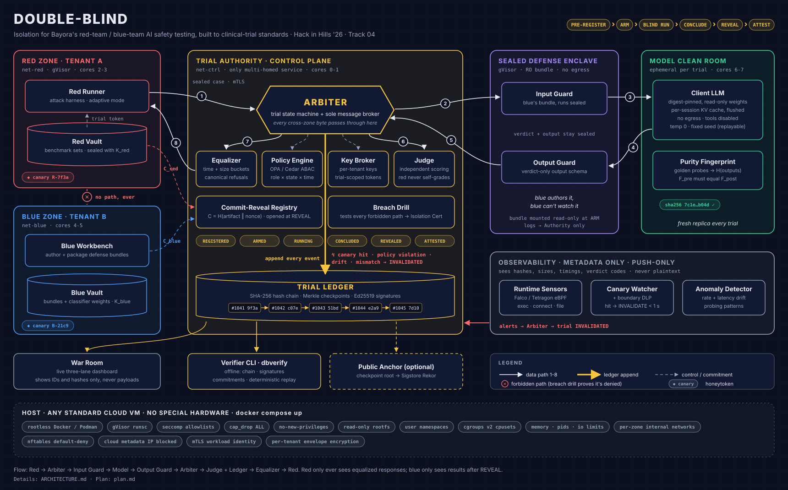
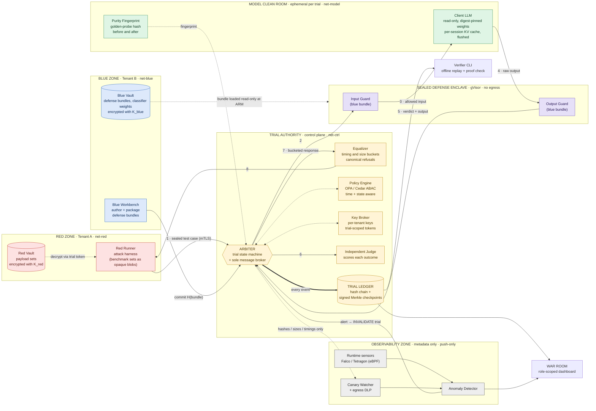
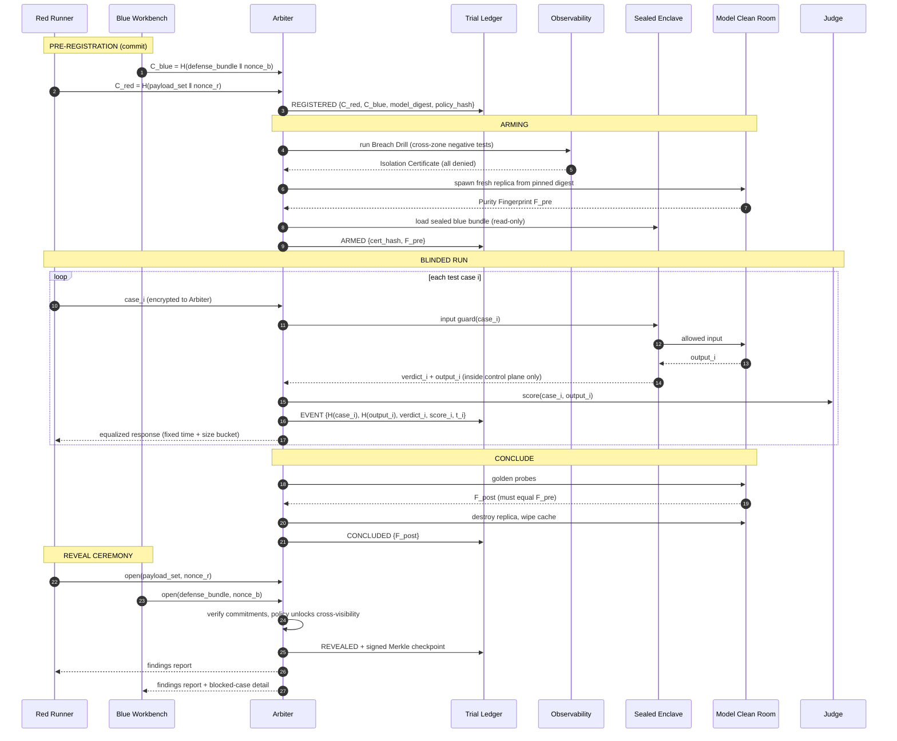
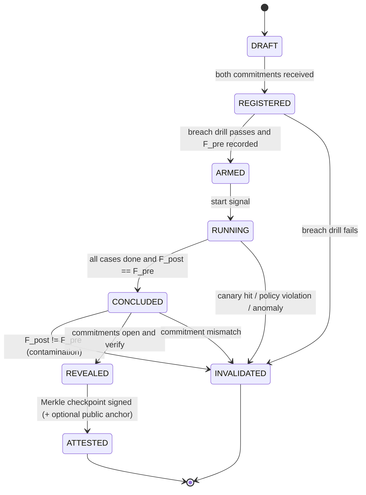
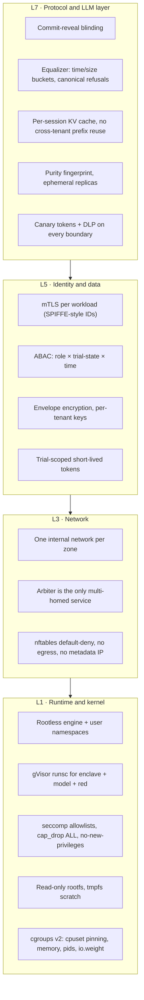
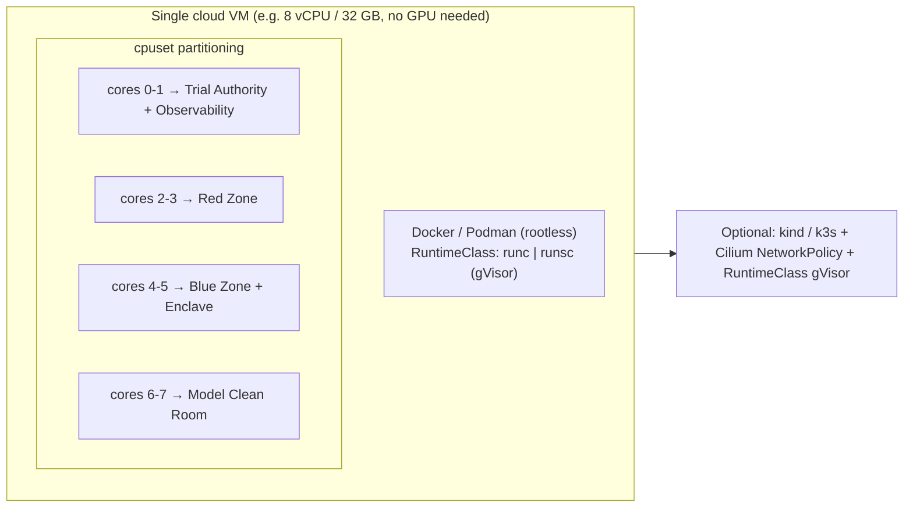

# DOUBLE-BLIND — Architecture

> Isolation built to clinical-trial standards for Bayora's red-team / blue-team AI safety testing.
> Each safety finding is **pre-registered, blinded, sealed, and can be replayed independently**.

This file holds the diagrams. For the rationale, tasks and schedule, see [`plan.md`](./plan.md).

*Pitch-ready diagram: [`docs/architecture.svg`](docs/architecture.svg) (PNG: [`docs/architecture.png`](docs/architecture.png)).
Regenerate it with `python3 docs/gen_architecture_svg.py docs/architecture.svg`. The Mermaid diagrams below are the
detailed, easy-to-edit versions.*

---

## 1. System architecture (trust zones)

Each coloured box is a **separate trust zone**. It has its own Docker network (`internal: true`), its own
cgroup/cpuset slice, and its own key material. **Zones never talk to each other directly.** Every
cross-zone message passes through the **Arbiter**, and the Arbiter writes each one to the ledger.

### Allowed-flow matrix (default deny, and the breach drill checks every cell)

| From ↓ / To → | Red | Blue | Arbiter | Enclave | Model | Ledger | Observability | Internet |
|---|---|---|---|---|---|---|---|---|
| **Red**        | —  | ❌ | ✅ mTLS | ❌ | ❌ | ❌ | ❌ | ❌ |
| **Blue**       | ❌ | —  | ✅ mTLS | ❌ | ❌ | ❌ | ❌ | ❌ |
| **Arbiter**    | ✅ (equalized only) | ✅ (post-reveal only) | — | ✅ | ✅ (control only) | ✅ append | ✅ metadata | ❌ |
| **Enclave**    | ❌ | ❌ | ✅ verdict | — | ✅ | ❌ | ❌ | ❌ |
| **Model**      | ❌ | ❌ | ✅ fingerprint | ✅ output | — | ❌ | ❌ | ❌ |
| **Observability** | ❌ | ❌ | ✅ alerts | ❌ | ❌ | ❌ | — | ❌ |

---

## 2. Life of a trial (sequence)

---

## 3. Trial state machine

---

## 4. Defense in depth: layers per zone

---

## 5. Deployment topology (PoC on one standard cloud VM)

> **Why one VM?** The problem asks for deployability on standard cloud and container runtimes. The same
> Compose file also runs on a laptop. The K8s manifests are a stretch goal that shows the design scales.

---

## 6. Implementation map

| Diagram component | Code | Verified by |
|---|---|---|
| Arbiter (state machine + broker) | `doubleblind/authority/service.py`, `authority/api.py` | `tests/test_e2e.py` |
| Equalizer | `authority/equalizer.py` | `bench/leakage.py`, e2e identical-size assertion |
| Policy Engine (ABAC) | `authority/policy.py`, `authority/policy.json` | exhaustive invariants (`python -m doubleblind policy`) |
| Key Broker | `authority/keybroker.py` | `tests/test_core.py` |
| Independent Judge | `authority/judge.py` | `tests/test_zones.py` |
| Trial Ledger + checkpoints | `authority/ledger.py`, `common/merkle.py` | tamper tests, verifier |
| Commit-Reveal Registry | `common/crypto.py`, `service.py::reveal` | `test_reveal_mismatch_invalidates`, `test_cases_outside_committed_set_invalidate` |
| Breach Drill → Isolation Cert | `drill/drill.py`, `drill/flow_matrix.json` | `make drill` in Docker (113/118, 8/8 positive controls) |
| Sealed Defense Enclave | `zones/enclave/` | bundle validation + enclave pipeline tests |
| Model Clean Room + Purity | `zones/model/` | purity drift + cache scoping tests, `bench/kvcache.py` |
| Canary Watcher + DLP, Anomaly Detector | `observability/` | canary breach/contained tests, canary drill |
| Pinned per-zone mTLS | `common/tls.py`, `deploy/certs.py` | `tests/test_mtls.py`, drill `mtls.*` |
| Verifier CLI | `verifier/` | `tests/test_verifier_drill_bench.py` |
| War Room | `warroom/` | headless-browser check (no console errors, no mobile overflow) |
| Host hardening | `docker-compose.yml`, `infra/` | drill `process.*`, `net.*`, `dns.*` checks |
