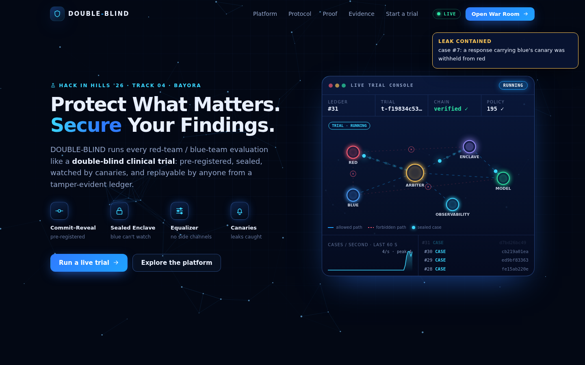
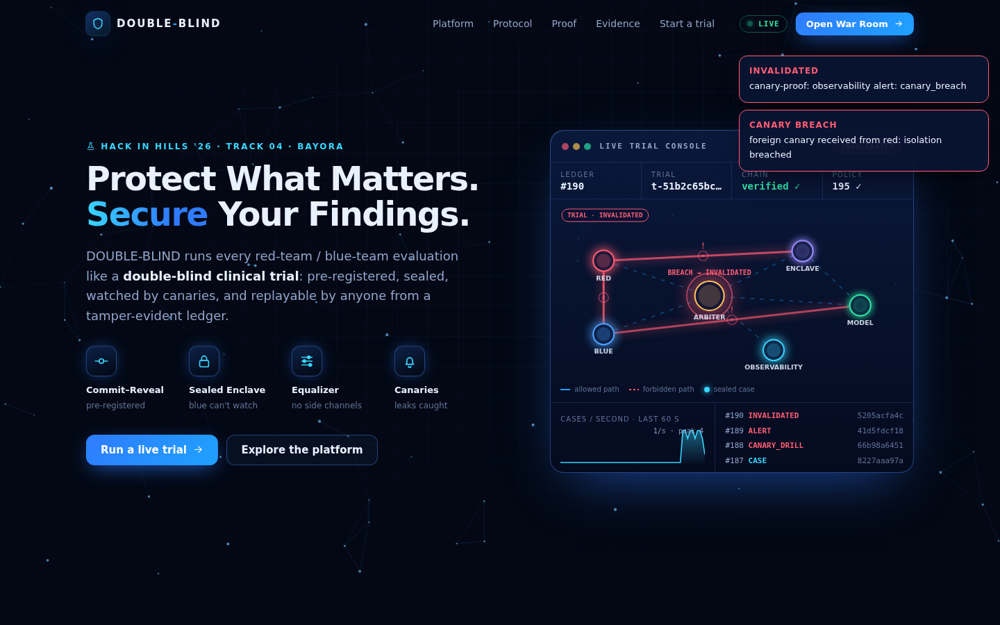
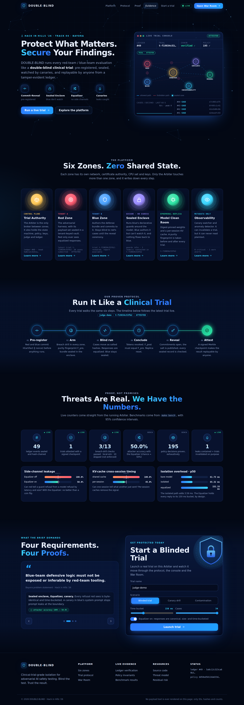
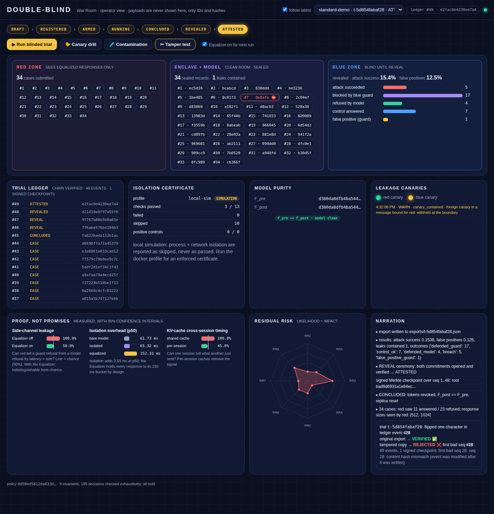

# DOUBLE-BLIND

**Isolation for adversarial AI safety testing, built to clinical-trial standards.** Hack in Hills '26 · Track 04 (Bayora)

> Other approaches put walls around containers. DOUBLE-BLIND runs each red-team / blue-team evaluation as a
> **double-blind clinical trial**: pre-registered with cryptographic commitments, blinded by construction,
> watched by canaries, and replayable by anyone from a tamper-evident ledger.


| | |
|---|---|
| Plan and rationale | [`plan.md`](plan.md) |
| Architecture diagrams | [`ARCHITECTURE.md`](ARCHITECTURE.md) |
| Threat model | [`docs/threat-model.md`](docs/threat-model.md) |
| Residual risk (the honest part) | [`docs/residual-risk.md`](docs/residual-risk.md) |
| Measured results | [`docs/results/`](docs/results/README.md) |

---

## What it does

Bayora's red team, blue team and client LLM share one sandbox. DOUBLE-BLIND makes every finding from that
sandbox **trustworthy**:

| Brief requirement | Mechanism | Where |
|---|---|---|
| Red payloads not observable by blue before the test concludes | Per-zone networks + pinned mTLS; blue's defense runs in a **sealed enclave** it cannot watch; cases, outputs and verdicts are **sealed** with a per-trial key; the ledger holds only **salted** hashes; exhaustively checked ABAC policy (`I1`) | `authority/service.py`, `authority/policy.json`, `zones/enclave/` |
| Blue logic not exposed *or inferable* by red | Red only reaches the Arbiter; responses are **equalized** (canonical refusal, size and time buckets); a **canary** in blue's system prompt stops prompt leaks at the boundary | `authority/equalizer.py`, `observability/` |
| Client LLM stays clean | Digest-pinned weights, per-session KV cache, reset per trial, **purity fingerprint** F_pre == F_post or the trial is invalidated | `zones/model/` |
| Findings not invalidated by leakage | **Breach drill** in every zone with positive controls → isolation certificate in the ledger; canary / purity / commitment failures **invalidate** the trial | `drill/`, `docker-compose.yml` |
| Audit integrity | Hash-chained ledger, signed Merkle checkpoints, **commit-reveal**, offline **verifier** with bit-for-bit **replay** | `authority/ledger.py`, `verifier/` |

## Proof, not promises

Measured in this repo (`make bench`; local simulation with the stub model, so the numbers show the mechanisms
rather than production latency):

| Metric | Without | With DOUBLE-BLIND |
|---|---|---|
| Can red tell a guard refusal from a model refusal (latency + size)? | **100%** attacker accuracy | **50.0%** (95% CI 44.6–55.4%): chance |
| Can one session tell what another just sent (KV-cache timing)? | **100%** with a shared cache | **45%** (95% CI 38–52%): chance |
| Latency added by the isolated path (p50) | 61.7 ms bare | +3.6 ms (+5.8%); Equalizer holds replies to its bucket by design |
| Ledger tamper detection | – | a 1-character edit is pinpointed to the exact event |
| Deterministic replay of a trial | – | 34/34 cases reproduced bit-for-bit |
| Breach drill in real Docker zones | – | 113/118 checks pass, 8/8 positive controls; the 5 failures are "no gVisor on this host", explicitly accepted and recorded |

## Quick start

### 1. Local simulation (no Docker), about 1 minute

```bash
make setup          # venv + dependencies
make test           # 74 tests
make demo           # standard trial → ATTESTED, canary drill → INVALIDATED,
                    # contamination → INVALIDATED, offline verify + replay, tamper test
make serve          # site at http://127.0.0.1:8100 · War Room at /warroom (both drive live trials)
```

In local mode all zones share one process. The breach drill says so: its certificate profile is `local-sim`,
process and network checks are **skipped, never passed**, and the verifier reports it as a warning.

### 2. Isolated deployment (Docker, one standard VM, no special hardware)

```bash
make env            # detect gVisor / seccomp / CPUs → .env (fallbacks become accepted risks)
make certs          # per-zone CAs + 30-day certificates
make build          # image from a local wheelhouse (reproducible)
make up             # authority, enclave, model, observability zones
make docker-trial   # drill in every zone → blinded trial → reveal → export → verify, then a canary drill
make down
```

The site is on `http://127.0.0.1:8100` and the War Room on `/warroom` (the operator listener is published on the host's loopback only).
Install [gVisor](https://gvisor.dev/docs/user_guide/install/) (`runsc`) to get the full sandbox. Without it,
`make env` records `process.gvisor_sandbox` as an accepted risk, and every trial's ledger shows it.

To use a real model, put a GGUF file in `models/`, set `DB_MODEL_BACKEND=llamacpp` and `DB_MODEL_SHA256`, and
run with `--profile llm`. The llama.cpp server then sits on its own internal network, reachable only from the
model wrapper.

### Real benchmark datasets

No harmful content ships in this repo. The demo suite is synthetic and benign. To use AdvBench, JailbreakBench,
HarmBench or similar, download the file yourself into `datasets/` and seal it straight into the red vault:

```bash
docker compose --profile tenants run --rm red-runner red init-vault --import /datasets/harmful_behaviors.csv --field goal
```

Records go straight into the encrypted vault; nothing prints them, and the War Room only ever shows IDs and hashes.

## The interface

**Site** (`/`): the front door. It keeps the look of a security product page but is wired to the running
Arbiter. It has:
- a particle-network hero, and a **live trial console** whose zone topology animates real sealed cases,
  contained leaks, drill sweeps and breaches from the event stream
- six zone cards, each with a live status line and a detail dialog
- a protocol timeline that follows the latest trial through every state
- count-up counters, some live and some from the benchmarks
- the brief's four requirements, each paired with its proof
- a form that launches a real trial (blinded, canary drill or contamination)

**War Room** (`/warroom`): the operator's lane-by-lane view of a trial.

| Live blinded trial | Breach caught |
|---|---|
|  |  |

<details><summary>Full page</summary>


</details>

## The demo (5 minutes)

1. **Pre-registration**: red and blue commit `H(artifact ‖ nonce)`; commitments land in the ledger.
2. **Arming**: breach drill → isolation certificate; purity fingerprint F_pre; bundle sealed into the enclave.
3. **Blinded run**: cases stream as IDs and salted hashes; blue's lane stays sealed; one prompt leak is *contained*.
4. **Side channel**: attacker accuracy 100% → 50% with the Equalizer (panel with confidence intervals).
5. **Canary drill**: a foreign canary arrives from red → critical alert → trial INVALIDATED within milliseconds.
6. **Reveal ceremony**: commitments open; salt published; signed Merkle checkpoint → ATTESTED.
7. **Tamper test**: flip one character in the ledger → the verifier names the exact event.
8. **Honesty**: residual-risk radar, and exactly which guarantees fail under which conditions.



## Repository layout

```
doubleblind/
  common/        crypto (commit-reveal, salted hashes, Ed25519, AES-GCM, tokens), Merkle, telemetry schema, mTLS
  authority/     Arbiter service + per-listener APIs, ledger, ABAC policy (+ policy.json), key broker,
                 trial state machine, equalizer, judge
  zones/         red (vault, datasets, client) · blue (bundle workbench) · enclave (sealed guards) · model (clean room)
  observability/ canary watcher, anomaly detector (metadata only)
  drill/         breach drill + flow matrix → isolation certificate
  verifier/      dbverify (offline, replay)
  bench/         leakage score, overhead, KV-cache isolation
  deploy/        zone services, PKI, Docker-mode CLIs
  warroom/       site (/) + War Room (/warroom): HTML/CSS/JS, no external dependencies
  local.py demo.py __main__.py
infra/           seccomp profile + builder, Falco rules, DOCKER-USER firewall
scripts/         gen_env.py, docker_trial.sh
tests/           74 tests: unit, e2e trials, verifier, drill, live mTLS
```

## CLI

```
python -m doubleblind demo | serve | bench | policy | verify EXPORT [--replay stub] | tamper EXPORT
python -m doubleblind service {arbiter,enclave,model,obs}        # inside containers
python -m doubleblind red|blue|operator ...                      # tenant and operator tooling
python -m doubleblind certs --out DIR
```
